# SkyNomad — NSDI '27 Artifact

Artifact for **SkyNomad: On Using Multi-Region Spot Instances to Minimize AI Batch
Job Cost** (NSDI '27 Spring), included here as `paper.pdf`.

SkyNomad schedules AI batch jobs across cloud regions to exploit heterogeneity in
spot availability, lifetime, and price, minimizing cost while meeting deadlines.

> `paper.pdf` is titled **SkyVoyager**, the double-blind submission alias; the
> camera-ready and this repository say **SkyNomad**.

Everything needed to reproduce the paper's figures ships inside this repository.
Beyond `uv sync`, there are no downloads, no cloud credentials, no accounts and no
GPU. Nothing after `uv sync` touches the network.

| Step | Your time | Machine time |
|---|---|---|
| `uv sync` + `prepare_data.sh` (once) | 1 min | 6 min |
| `reproduce_all.sh` + `verify_figs.py` | 1 min | 2 min |
| Re-running the sweeps behind the figures | 2 min | 3 min |

`prepare_data.sh` writes generated traces under `data/`; everything else writes under
`outputs/`. Nothing outside the clone is touched, and every step is safe to repeat.

| | |
|---|---|
| Availability across 8 of the 13 GCP zones (Fig 2a) | Cost vs deadline tightness (Fig 10a) |
| 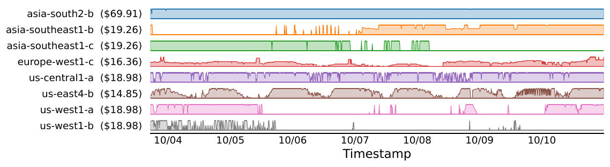 | 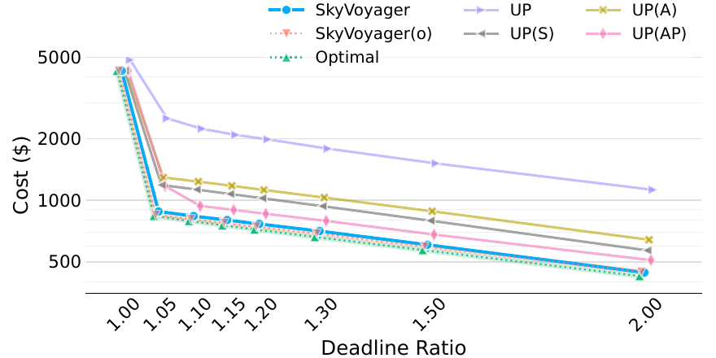 |
| Cost vs number of regions (Fig 10b) | H100 trace comparison (Fig 9a) |
| 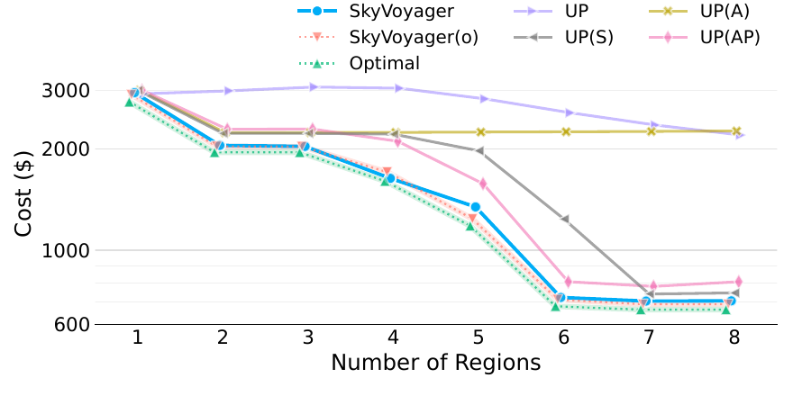 |  |

---

## Availability

| | |
|---|---|
| Source repository | https://github.com/andylizf/skynomad-artifact |
| Release | tag `nsdi27-ae` |

The repository is public and clonable without credentials.

Apache-2.0 (`LICENSE`), except `paper.pdf` and `paper_figs/`, which are the paper
itself and carry the authors'/USENIX copyright. See `NOTICE`.

---

## Getting Started

Requires Python 3.10+, [uv](https://docs.astral.sh/uv/) and `pdftotext` (macOS
`brew install poppler`, Debian `apt install poppler-utils`). No GPU. `uv sync`
fetches about 1 GB; the clone plus the traces it unpacks come to about 200 MB.
About 5 minutes on a fast link.

```bash
uv sync
source .venv/bin/activate

# Unpack the H100 traces and rebuild the V100 aligned traces. ~1 min, no network.
bash artifact/prepare_data.sh

# Smoke test: one figure.
python research/plot_deadline_sensitivity.py \
    --input research/data/deadline_sensitivity.csv \
    --output outputs/figures/deadline_sensitivity.pdf
```

Every `python` below assumes that activation; without it, prefix with `uv run`.

Compare what you get against Figure 10a, the left panel of Figure 10 on page 12 of
`paper.pdf`. The curves and axis values should be identical:

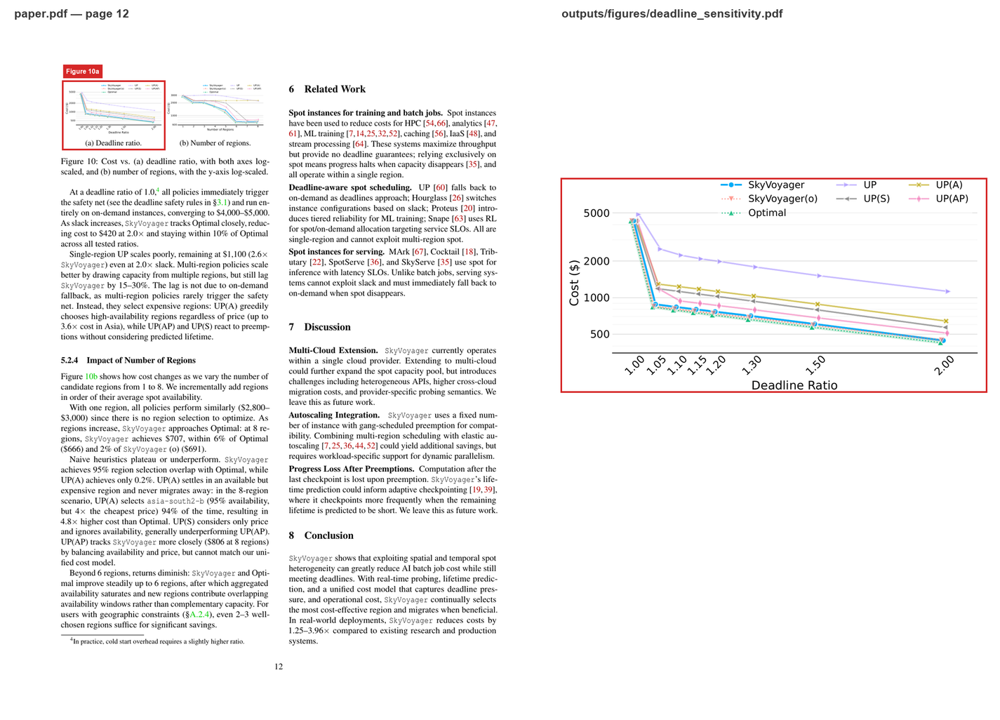

If they are, the artifact is functional.

---

## Reproduce every figure

```bash
bash artifact/reproduce_all.sh
python artifact/verify_figs.py
```

The first writes the 19 figure PDFs under `outputs/` — 13 directly in
`outputs/figures/`, the rest in per-figure subdirectories — with a `.values.csv`
beside each of the eleven figures that carry one, plus an exit code and wall time per
figure in `outputs/reproduce.log`. The second walks all of them and prints one line
per figure.

Expected, on a fresh `outputs/`:
`matched=19  mismatched=0  missing=0  errors=0  caveats=0`.

Afterwards `outputs/figures/` holds:

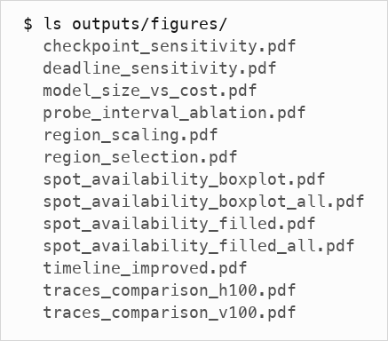

`verify_figs.py` checks each figure twice, and both must pass: the text layer
against the paper's own PDF under `paper_figs/`, which catches changed axis ticks,
ranges and legends; and the plotted series, which each data-bearing figure's script
writes to `<figure>.values.csv` and which is compared cell by cell against
`paper_figs/values/` at 1% relative tolerance. The second is the check that sees
the numbers — scaling SkyNomad's cost by 30% in `research/data/*.csv` reports
`VALUES DIFF` on all six result figures, and zeroing a zone's availability in
`data/h100_16_runs/` reports it on Figures 2a and 11a.

Eleven of the 19 checked figures have a sidecar: the six result figures (9a, 9b,
10a, 10b, 12, 15), the four availability figures (2a, 2b, 11a, 11b) and Figure 14.
The other eight — Figure 3's two panels, 4b, 7's three panels, 8 and 13 — are
checked on their text layer only, so a changed line vertex or bar height in those
would not be caught. Their generating scripts are named in the figure map below,
and re-running one is what checks its numbers.

### Figure map

Where a figure has two panels, the thumbnail shows the first.

| Figure | Claim | Script |
|---|---|---|
| **2**<br>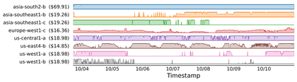 | Availability and lifetime vary widely across regions | `research/plot_availability_filled.py`<br>`research/plot_availability_boxplot.py` |
| **3**<br>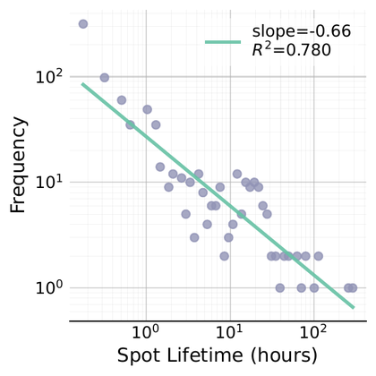 | Spot lifetime distributions differ by accelerator | `scripts_multi/trace_sampling/spot_duration_prediction_analysis/`<br>`analyze_duration_distribution{,_v100}.py` |
| **4b**<br>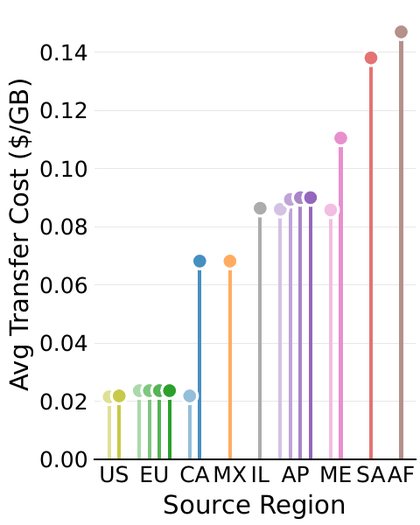 | Migration egress cost across regions | `research/migration_costs.py` |
| **7**<br>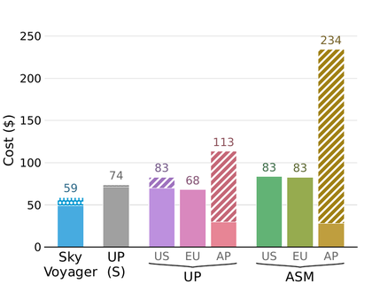 | End-to-end cost vs baselines (L4 / A100 / A10G) | `research/cost_comparison_bar.py` |
| **8**<br>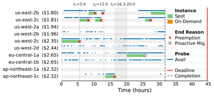 | Migration timeline in the L4 experiment | `research/e2e_timeline.py` |
| **9**<br>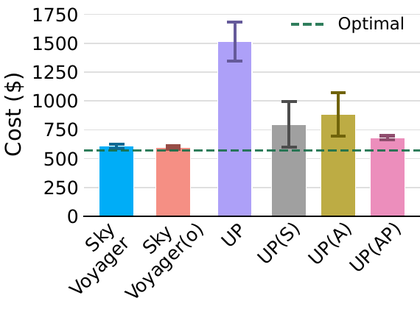 | Simulation across accelerators (H100 / V100) | `research/plot_traces.py --legacy` |
| **10a**<br>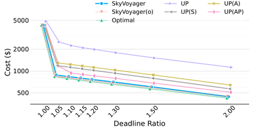 | Cost vs deadline tightness | `research/plot_deadline_sensitivity.py` |
| **10b**<br>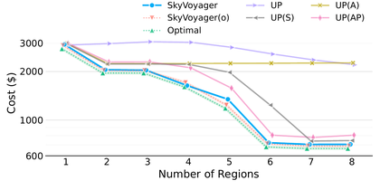 | Cost vs number of regions | `research/plot_region_scaling.py` |
| **11**<br>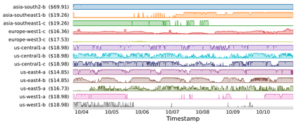 | Availability across all 13 zones (appendix) | `research/plot_availability_*.py --all-regions` |
| **12**<br>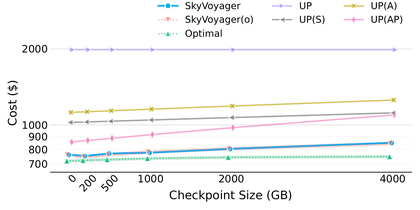 | Cost vs checkpoint size (appendix) | `research/plot_checkpoint_sensitivity.py` |
| **13**<br>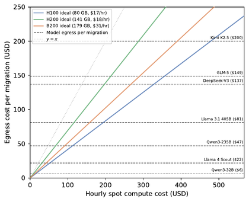 | Egress vs compute cost by model size (appendix) | `artifact/plot_model_size_vs_cost.py` |
| **14**<br>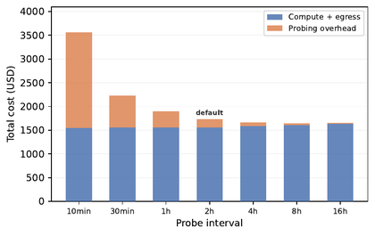 | Cost breakdown vs probe interval (appendix) | `artifact/probe_interval_ablation.py` |
| **15**<br>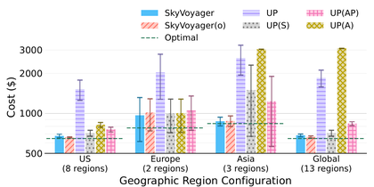 | Cost under geographic constraints (appendix) | `research/plot_region_selection.py` |

Figures 1, 5 and 6 are schematics with no underlying computation, and are omitted
here.

---

### The appendix's progress-value ablation

`reproduce_all.sh` runs this as its last step; to run it alone:

```bash
python artifact/v_ablation.py
```

Six closed-form progress values through the same utility pipeline, so V is the only
thing that varies. Four cells, twelve stratified windows each; about 30 seconds.

| V candidate | V100 1.5x | V100 2.0x | H100 1.5x | H100 2.0x | sum |
|---|---|---|---|---|---|
| Optimal | $33.15 | $24.76 | $522.72 | $390.93 | |
| **Log-barrier (default)** | **+9.60** | +5.83 | +62.59 | **+30.92** | **+108.95** |
| Quadratic surrogate | +30.95 | **+5.11** | **+38.42** | +35.26 | +109.75 |
| alpha=0.5 | +9.86 | +5.54 | +64.70 | +31.26 | +111.35 |
| HJB exponential | +9.90 | +5.50 | +66.20 | +33.91 | +115.51 |
| Time-only | +27.73 | +8.52 | +40.91 | +44.26 | +121.42 |
| Neely DPP | +10.67 | +9.98 | +68.88 | +35.67 | +125.21 |

Each entry is the candidate's mean cost minus Optimal's on the same windows, at the
two decimals the appendix prints; the sum column adds the unrounded values.
`tests/test_a7_table.py` pins the table.

---

## Re-running the simulation sweeps

The figure scripts above replot stored results. This regenerates
`research/data/*.csv` from the traces:

```bash
BM=scripts_multi/benchmark_multi_region_modular.py

python $BM --config deadline_sensitivity   --output-dir outputs/rerun
python $BM --config region_scaling         --output-dir outputs/rerun
python $BM --config region_selection       --output-dir outputs/rerun
python $BM --config checkpoint_sensitivity --output-dir outputs/rerun
python $BM --config v100 --output-dir outputs/rerun
```

Each writes `outputs/rerun/<config>/scenario_results_tfull.csv` with the same
columns as `research/data/<config>.csv`. To check a re-run against the file it
should reproduce, rather than take the table below on trust:

```bash
python artifact/compare_sweep.py --all
```

It matches rows on strategy, task type, region, window and every swept parameter,
reports the largest disagreement in cost, and exits non-zero if anything is
outside `--tolerance`. Replot a re-run with e.g.
`python research/plot_deadline_sensitivity.py --input <that csv> --output <pdf>`.

Wall times are from a 12-core Apple-silicon laptop, cold cache; every config
saturates all cores, so expect two to four times these on a slower machine.

| Config | Simulations | Wall time | vs shipped CSV |
|---|---|---|---|
| `deadline_sensitivity` | 648 | 21 s | **0%** on all 54 points |
| `region_scaling` | 1014 | 39 s | **0%** on all 78 points |
| `region_selection` | 300 | 16 s | **0%** on all 24 points |
| `checkpoint_sensitivity` | 504 | 24 s | **0%** on all 42 points |

`--config v100` (50 simulations, 44 s) regenerates Figure 9(b) from the traces
`prepare_data.sh` rebuilds out of the raw availability CSVs. The arms are Optimal
(the offline DP lower bound), SkyNomad(o) (SkyNomad given oracle lifetimes), and the
uniform-probing baselines UP(S), UP(A) and UP(AP); "Running the simulator directly"
below maps the baselines to their `--strategy` names.

| | rerun | shipped | delta |
|---|---|---|---|
| Optimal | $37.37 | $37.37 | **0%** |
| UP(S) | $47.02 | $47.02 | **0%** |
| UP(A) | $49.09 | $49.09 | **0%** |
| UP(AP) | $51.00 | $51.00 | **0%** |
| SkyNomad(o) | $41.99 | $41.99 | **0%** |
| **SkyNomad** | **$41.73** | **$41.73** | **0%** |

All six arms, all five windows.

Trace generation is deterministic: delete `data/converted_multi_region_aligned`,
re-run `prepare_data.sh`, and the nine `full.json` series come back identical. The
V100 traces carry a per-tick spot price per zone, cross-checked against the public
AWS spot price archive. See `data/README.md`.

---

## Running the simulator directly

```bash
python main.py \
    --strategy=unified_cost_model_risk \
    --env=multi_trace \
    --trace-files data/converted_multi_region_aligned_h100_16_merged/*/full.json \
    --task-duration-hours 41.18 --deadline-hours 70 \
    --restart-overhead-hours 0.2 --checkpoint-size-gb 500 \
    --output-dir outputs/sim
```

`--strategy` above is SkyNomad. The baselines the paper reports are
`unified_cost_model_oracle` (SkyNomad(o)), `multi_region_oracle_dp` (Optimal),
`multi_region_rc_cr_threshold_eager_failover` (UP(S)),
`multi_region_availability_probe_simple` (UP(A)) and
`multi_region_probe_cost_ratio` (UP(AP)). `main.py --help` lists the rest.

## Tests

```bash
uv sync --extra test
python -m pytest tests/ -q          # 109 pass
python -m pytest tests/ -q -m "not slow"   # skips the 192-simulation table check
```

The trace-dependent tests skip until `artifact/prepare_data.sh` has run.

## Layout

```
sky_spot/        simulator core (envs, strategies, cost model)
  strategies/unified_cost_model.py   SkyNomad
  e2e/           the deployment scheduler behind §5.1's measurements
eval/            the workloads §5.1 ran
research/        figure scripts, plus the stored results they plot
  data/*.csv     precomputed simulation results
  real.csv       end-to-end summary (Figure 7)
  history.jsonl  per-tick log of one L4 run (Figure 8)
scripts_multi/   benchmark drivers and trace generation
  benchmark_components/configs/  the named --config sweeps
data/            traces and raw probes; see data/README.md
paper_figs/      the paper's figure PDFs, for verify_figs.py to diff against
  values/        reference numeric sidecars
artifact/        setup, reproduction, verification
tests/           unit tests (pytest)
```

Figure 4b reads the shipped `research/data/aws_egress_pricing.csv` (1122 region
pairs, exported from the AWS Pricing API), so it works without credentials.

---

## Artifact claims

**The H100 traces are the main reusable asset.** `data/h100_16_runs/` holds
availability probes for 16 `a3-highgpu-1g` (1×H100) instances across 13 GCP zones,
sampled every 10 minutes for 14 days. Collecting it cost roughly **$9,000** in
cloud spend (§5.2.1). It is released so others need not repeat that expense.

**What reproduces.** Figures 2, 3, 4b, 7, 8, 9, 10a, 10b, 11, 12, 13, 14 and 15
regenerate from the shipped data, and `artifact/verify_figs.py` checks each one
against the paper's own PDF on the text layer, and Figures 9, 10a, 10b, 12 and 15
additionally on the plotted series. The appendix's
progress-value table's entries reproduce to the two decimals it prints. Beyond
replotting,
the simulation results behind those figures regenerate from the traces with the
`--config` sweeps above. Across the five that is 204 comparisons — every strategy at
every point of `deadline_sensitivity` (54), `region_scaling` (78),
`region_selection` (24) and `checkpoint_sensitivity` (42), plus every arm of `v100`
(6) — and **all 204 reproduce the shipped CSVs to 0%**, each from a single `--config`
invocation, which `python artifact/compare_sweep.py --all` checks row by row. Figures 7 and 8 replot stored end-to-end
measurements and are excluded from what we claim under Results Reproduced.

### Limitations

1. **The end-to-end experiments cannot be re-run at reasonable cost.** §5.1 used
   real AWS spot instances — `g6.12xlarge` (4×L4), `p4d.24xlarge` (8×A100),
   `g5.12xlarge` (4×A10G) — with 100–500 GB checkpoints across multiple regions,
   long enough to observe preemptions. A single configuration runs into the
   thousands of dollars and needs multi-region GPU spot quota.

   What ships for Figures 7 and 8: `research/real.csv`, the final cost of each
   system per accelerator, and `research/history.jsonl`, a per-tick log of one L4
   run. The scheduler that drove them is in `sky_spot/e2e/` and the workloads in
   `eval/`; both ship here, but re-running them is what costs the thousands of
   dollars above.

2. **Figure 4a plots a price window the AWS API no longer serves.** It covers
   `p4d.24xlarge` spot prices for October–November 2025, and
   `DescribeSpotPriceHistory` retains only 90 days. `research/spot_price.py` runs
   against the live API and reproduces the figure over a current window; the
   on-demand reference line is unchanged and reproduces exactly.

   The published window is still obtainable from Eric Pauley's public AWS Spot
   Price History archive on Zenodo
   ([10.5281/zenodo.14198917](https://doi.org/10.5281/zenodo.14198917); the
   monthly files are `2025-10.tsv.zst` and `2025-11.tsv.zst`).
